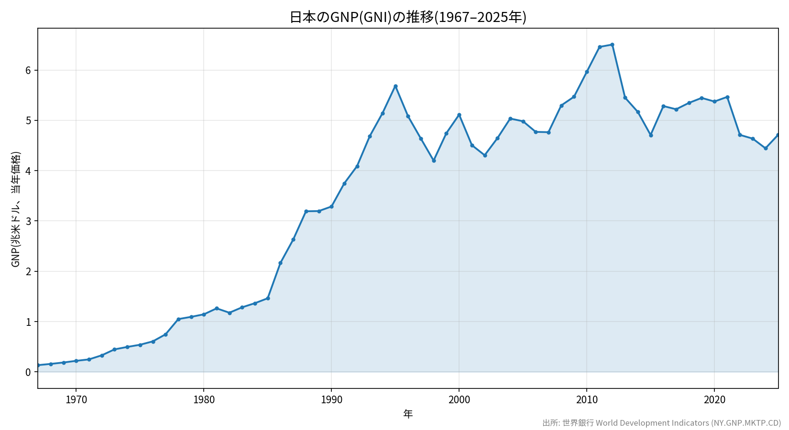
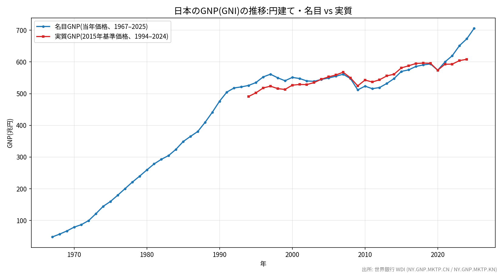

# kklab-kimi-samples

日本のGNP(国民総所得 = GNI)の推移を可視化し、GitHub Pagesで公開しているリポジトリです。

- **公開ページ**: https://katzkawai.org/kklab-kimi-samples/
- **データ出所**: 世界銀行 World Development Indicators (WDI)
  - `NY.GNP.MKTP.CD` — GNI(当年価格・米ドル)
  - `NY.GNP.MKTP.CN` — GNI(当年価格・円)
  - `NY.GNP.MKTP.KN` — GNI(2015年基準の実質・円、1994–2024年のみ公表)
  - `NY.GDP.MKTP.CN` / `NY.GDP.MKTP.KN` — GDPデフレーター算出用(実質GNP 1967–1993年・2025年の推計に使用)

## グラフ

### ドル建て(当年価格)

### 円建て(名目・実質)

## 考察

- **ドル建てでは為替の影響が大きい**: 1967年の約0.13兆ドルから円高を背景に急拡大し、2012年に過去最高の約6.5兆ドルを記録。近年は円安でドル換算が縮小し、2024年は約4.4兆ドル。ドル建ての増減は経済規模そのものより為替レートの変動を強く反映する
- **近年のドル建てGNP減少はほぼ円安が原因**: 2012年→2024年にドル建てGNPは6.51兆→4.45兆ドルと約32%減少したが、同期間の円建て名目GNPは519兆→673兆円と約30%増加している。乖離の正体は為替で、データから算出した換算レートは80円/ドル(2012年)→151円/ドル(2024年)と約90%円安に振れた。背景には、2022年以降の米FRBの急激な利上げと日本銀行の金融緩和継続による日米金利差の拡大がある。円建てで経済が縮小したわけではないため、ドル建て系列だけで日本経済の実力を評価するのは誤解を招く。なお、この為替要因により2023年にはドル建て名目GDPで日本はドイツに抜かれ、世界4位に後退した(IMFベース)
- **円建て名目では一貫して増加**: 2025年には約706兆円に達し、ドル建てで見えた近年の「縮小」は為替(円安)によるものだったことがわかる
- **実質成長は1990年代半ば以降に鈍化**: 推計値では高度成長期に実質GNPは1967年の約150兆円から1990年の約470兆円へ約3倍に拡大。一方、1994年の約491兆円から2024年の約608兆円までの30年間は約1.24倍(年率0.7%程度)にとどまり、「失われた30年」の停滞が確認できる
- **2020年の落ち込みと回復**: コロナ禍で名目・実質ともに2020年に低下し、その後回復
- **2022年以降は名目の伸びが実質を大きく上回る**: GDPデフレーターの上昇(インフレ)の定着を反映している

### 円安が日本経済に与える影響

近年のドル建てGNP減少の主因である円安は、日本経済にプラスとマイナスの両面の影響を与えている。

**プラス面**

- **輸出産業の収益改善**: 輸出競争力の向上に加え、ドル建ての売上・海外子会社の利益が円換算で膨らみ、輸出企業を中心に企業業績を押し上げた
- **海外からの所得収支の拡大**: 日本は対外純資産世界最大級で、海外資産からの利子・配当・事業収益が円換算で増大。GNP(= GDP + 海外からの純所得)がGDPより速く伸びている一因であり、本データで名目GNPが2022年の約620兆円から2025年の約706兆円へ大きく伸びた背景にもなっている
- **インバウンド需要の拡大**: 訪日外国人旅行が急増し、観光・宿泊・小売など国内サービス業の需要を下支えした
- **名目成長・税収の押し上げ**: 物価上昇と企業収益の改善で名目GDP・税収が増加し、財政面ではプラスに働いた

**マイナス面**

- **輸入物価の上昇と家計負担**: エネルギー・食料を輸入に依存する日本では、円安がコストプッシュ型インフレを招き、実質賃金を押し下げた。名目と実質の乖離(2022年以降)はその表れである
- **交易条件の悪化による所得の海外流出**: 輸入価格が輸出価格より大きく上昇し、実質所得の一部が海外に移転。実質GNIの伸びが実質GDPを下回る局面が生じた
- **国内産業の空洞化リスク**: 円安でも国内生産回帰が限定的な場合、輸出数量は伸びず価格効果だけが残り、製造業の国内基盤強化につながらない
- **対外的な経済プレゼンスの低下**: ドル建てでの経済規模の縮小は、国際比較における日本の相対的な地位低下(1人当たり所得の順位低下など)として現れる

**総合すると**: 円安は企業部門(特に輸出・海外展開企業)と海外資産の円換算価値を押し上げる一方、家計の実質購買力を侵食する構造になっており、受益と負担の分布が大きく偏っている。日本銀行は2024年にマイナス金利を解除するなど金融政策の正常化を進めており、今後の為替水準と金利差の動向がこの構図を左右する。

## ファイル構成

| ファイル | 内容 |
|---|---|
| `index.html` | GitHub Pagesのトップページ(グラフ + データ表) |
| `japan_gnp.png` | ドル建てGNPの推移グラフ(1967–2025年) |
| `japan_gnp_yen.png` | 円建て・名目/実質GNPの推移グラフ |
| `japan_gnp.csv` | ドル建てGNPデータ(年・兆米ドル・米ドル) |
| `japan_gnp_yen.csv` | 円建てGNPデータ(年・名目・実質、兆円) |
| `plot_japan_gnp.py` | ドル建てグラフの描画スクリプト |
| `plot_japan_gnp_yen.py` | 円建てグラフの描画スクリプト |
| `gen_index.py` | CSVから `index.html` を生成するスクリプト |

## 更新方法

1. データ取得(世界銀行API経由)で `/tmp/japan_gni_full.csv` / `/tmp/japan_gni_yen.csv` を更新
2. `python3 plot_japan_gnp.py` / `python3 plot_japan_gnp_yen.py` でグラフ再生成
3. `python3 gen_index.py` で `index.html` 再生成
4. コミットして `main` に push すると GitHub Pages が自動で再デプロイされる

## 更新履歴

### 2026-08-01

- 初回公開
- 世界銀行WDIから日本のGNP(GNI)データ(1967–2025年)を取得
- ドル建て(当年価格)グラフとデータ表を作成・公開
- 円建て・名目/実質グラフとデータ表を追加
- GitHub Pages として公開
- README.md を追加(リポジトリ構成・更新履歴)
- README.md にドル建て・円建てグラフを埋め込み
- 円建てデータ表の実質GNPの欠損(1967–1993年・2025年)をGDPデフレーターによる推計値で補完し、グラフに推計区間(破線)を追加
- README.md に考察セクションを追加
- 考察に「近年のドル建てGNP減少はほぼ円安が原因」の分析を追記(為替レートの定量評価つき)
- 考察に「円安が日本経済に与える影響」(プラス/マイナス両面の整理)を追記
